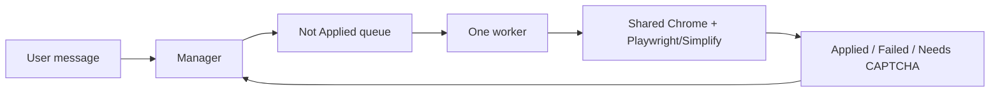

# Jaswanth's job-application agent

An AI-assisted job-application system built with LangGraph and LangChain. A
manager agent reads jobs from `data/jobs.xlsx`, delegates one job at a time to
a browser-owning worker, and records application outcomes, checkpoints,
metrics, and reusable job-board learnings.

## Current operating model



The manager processes the queue sequentially: it waits for one
`delegate_job_application` call to finish before requesting the next job. A
CAPTCHA-held job is removed from the runnable queue and requeued at the tail
only after the user completes it.

See [docs/architecture.md](docs/architecture.md) for the complete graph,
state, retries, runtime controls, and persistence model.

## Features

- LangGraph manager and worker graphs with bounded recursion limits.
- Excel-backed job queue with exact-job lookup and status transitions.
- Tailored LaTeX/PDF résumé generation before each application.
- Playwright MCP browser control sharing a Chrome CDP session with Simplify.
- CAPTCHA tab preservation, atomic checkpoints, and resumable applications.
- Unknown application questions can pause for a terminal or Telegram answer;
  answers are saved for later applications.
- Per-job logs, lifecycle events, destination/model/tool metrics, and Telegram
  monitoring/control.
- macOS `launchd` supervision and a local Unix-socket input channel.

## Important safety status

The code contains a `human_approval_node`, but the current
`DANGEROUS_TOOLS` allowlist is empty. Therefore tool calls are currently
auto-approved, including browser actions, workbook writes, file updates, and
MCP actions. Do not rely on the old “approval for every tool call” wording in
older documentation until that allowlist is populated and tested.

## Project structure

```text
langgraph/
├── src/agent/          # LangGraph graphs, nodes, and native tools
├── src/application/    # Tailoring, checkpoints, CAPTCHA, forms, metrics
├── src/automation/     # Simplify and browser automation helpers
├── src/cli/            # Terminal commands and UI
├── src/core/           # Configuration and redacted logging
├── src/data/           # Workbook and candidate-profile helpers
├── src/jobs/           # Job discovery and profile extraction
├── src/notifications/  # Console/Telegram events and formatting
├── src/runtime/        # Pause/stop/input/approval control plane
├── mcp_client/         # MCP adapters and server configuration
├── prompts/            # Manager and worker operating instructions
├── skills/jobboards/   # Platform-specific reusable guidance
├── tests/              # Unit and integration tests
└── docs/               # Architecture and test-plan documentation
```

## Setup

Requires Python 3.11+ and [uv](https://docs.astral.sh/uv/).

```bash
uv sync
printf '%s\n' 'OPENROUTER_API_KEY=your_key_here' > .env
```

The model defaults to `OPENROUTER_MODEL` when set, otherwise
`openai/gpt-5.6-luna`. Browser MCP and Telegram settings are configured in
`.env`; see `mcp_client/servers.json` and `src/notifications/telegram_service.py`.

### Shared Chrome and Simplify

The application starts/attaches to a Chrome instance with a local Chrome
DevTools Protocol endpoint. Playwright MCP and Selenium operate on that same
session so Simplify can populate the active application form.

```dotenv
SIMPLIFY_EXTENSION_ID=pbanhockgagggenencehbnadejlgchfc
CHROME_AUTOMATION_USER_DATA_DIR=/Users/<you>/Library/Application Support/Google/Chrome-Automation
CHROME_PROFILE_DIRECTORY=Default
CHROME_DEBUGGING_PORT=9222
```

Keep the CDP endpoint local: it grants browser-profile control to the agent.

### Tailored documents

Keep the source résumé at `user_details/master_resume.tex`. Tailoring writes
new `.tex`/`.pdf` files under `user_details/tailored/`; it never edits the
master résumé or the existing default PDF. Each worker receives an absolute
`ACTIVE TAILORED RESUME` path and must use that path for uploads.

For each résumé request, every non-hidden file in `user_details/projects/` is
given to the tailoring model. It chooses the two or three most relevant,
source-supported projects for the target role. Edit
`prompts/resume_tailoring_systemprompt.md` to change that selection and
tailoring guidance; the file is read again for every résumé request.

## Run interactively

```bash
uv run python -m src.agent.app
```

The terminal is one input channel. In a launchd-managed run with no usable
stdin, messages arrive through the local socket or Telegram instead.

## macOS launchd supervisor

Install once:

```bash
uv run python scripts/agentctl.py install
```

Then use:

```bash
uv run python scripts/agentctl.py /start
uv run python scripts/agentctl.py /stop
uv run python scripts/agentctl.py /restart
uv run python scripts/agentctl.py /status
uv run python scripts/agentctl.py logs --follow
uv run python scripts/agentctl.py /send "show pending jobs"
```

The `agentctl.py` commands control the launchd service itself: `/stop` unloads
the service and `/start` bootstraps it only when it is not already loaded. They
do not inspect or resume a runtime that is already loaded but internally
stopped. When Telegram is enabled, its `/start`, `/status`, `/pause`,
`/resume`, and `/stop` commands operate on the in-process runtime. Telegram
`/stop` is cooperative at the next graph/tool boundary; it does not terminate
the launchd process. Messages sent through the Unix socket are queued for the
manager.

## Telegram controls

```dotenv
TELEGRAM_ENABLED=true
TELEGRAM_BOT_TOKEN=...
TELEGRAM_ALLOWED_CHAT_ID=...
```

Only the configured chat ID receives events or controls. Telegram can show
status, pause/resume/stop the runtime, resolve approval requests when approval
is enabled, answer profile questions, and mark CAPTCHA-held jobs complete.

## Built-in terminal commands

- `/help` — show the command/tool reference.
- `/index` — write a recursive project map to `explore.md`.
- `/clear` — clear active conversation history.
- `/plan` — make the next request return a plan without tool execution.

## Tests

```bash
uv run pytest
```

## Operational notes

- A service process can be “running” under launchd while the runtime is
  `stopped`, `paused`, or waiting for input; inspect runtime/Telegram status and
  recent logs before assuming work is active.
- Browser submission-like actions are not retried automatically because a
  failed response does not prove the action failed.
- CAPTCHA-held tabs must not be navigated away from; the manager opens a new tab
  for later jobs.
- Workbook status updates and profile answers are persistent state changes.

## License

This project is licensed under the [MIT License](LICENSE).
