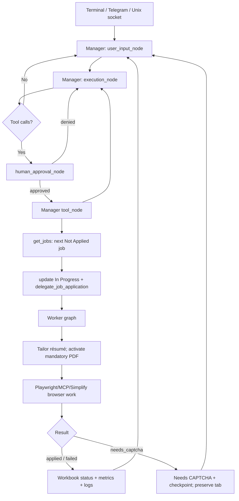

# Application architecture

## What this application is

Jaswanth's Agent is a stateful job-application automation system built with
LangGraph. It has two graphs:

- The **manager graph** accepts user work, reads the Excel application queue,
  and delegates jobs one at a time.
- The **worker graph** owns one delegated application. It drives the shared
  Playwright/Selenium Chrome session, fills the form, handles application
  questions, and reports `applied`, `failed`, or `needs_captcha`.

The process is normally supervised by macOS `launchd`. A running launchd
process does not necessarily mean a task is running: `/stop` changes the
in-memory runtime to `stopped`, after which the graph waits for another input.

## End-to-end flow



The manager waits for `delegate_job_application` to finish before requesting
the next job. This makes queue processing sequential at the manager level,
even though a worker may issue many browser and native-tool calls.

## Manager graph

Defined in `src/agent/app.py` with `ManagerState`:

```python
class ManagerState(MessagesState, total=False):
    subagents: list
    tool_calls: list[dict] | None
    model: Any
    plan_mode: bool
    skip_execution: bool
    queue_exhausted: bool
```

The graph is:

```text
START
  -> user_input_node
  -> execution_node
       -> human_approval_node -> tool_node -> execution_node
       -> user_input_node
```

Important routing rules:

- Slash commands are handled directly and do not make an LLM call.
- A normal message enters `execution_node`, which streams the manager model
  and records its tool calls.
- If `get_jobs` returns an empty list, `tool_node` sets `queue_exhausted`.
  The manager then waits for a new user message instead of repeatedly polling
  the workbook.
- Manager invocation uses a LangGraph recursion limit of **200**.

The manager is bound to these native tools:

| Tool | Role |
|---|---|
| `get_jobs` | Read the next queue item or one exact job from `data/jobs.xlsx` |
| `update_job_status` | Set `In Progress`, `Applied`, `Failed`, etc. |
| `get_job_profile_from_url` | Normalize a user-supplied job URL |
| `insert_job_profile_to_excel` | Upsert that normalized profile |
| `delegate_job_application` | Run one worker for one exact job |
| `tailor_application_documents` | Explicit manager-side résumé/cover-letter tool |

The manager prompt requires sequential processing, exact job dictionaries, and
status updates around each delegation. It also says that a CAPTCHA job must
remain in the queue as `Needs CAPTCHA` and must not be marked failed.

## Worker graph

Defined in `src/agent/app.py` with `WorkerState`:

```python
class WorkerState(MessagesState, total=False):
    approved: bool
    tool_calls: list[dict] | None
    model: Any
```

The worker graph is:

```text
START -> execution_node
          -> human_approval_node -> tool_node -> execution_node
          -> END (when there are no tool calls)
```

Each worker receives the manager's job dictionary plus the user profile and
the absolute `ACTIVE TAILORED RESUME` path. Before browser work it:

1. Requires a stored job description.
2. Generates tailored LaTeX/PDF documents from
   `user_details/master_resume.tex`.
3. Reads every non-hidden project file in `user_details/projects/` and gives
   the complete catalog to the tailoring model.
4. Uses the editable `prompts/resume_tailoring_systemprompt.md` to have the
   model select the two or three most relevant, source-supported projects.
5. Activates the tailored PDF as the only permitted resume upload.
6. Starts application metrics and loads any prior checkpoint.
7. Creates a new browser tab when another job is holding a CAPTCHA tab.
8. Runs the worker graph with recursion limit **350**.

The worker model can use browser MCP tools plus native helpers for Simplify,
dropdown selection, Workday source selection, profile answers, file reads and
updates, workbook status updates, and document tailoring. Browser tools share
the Chrome CDP session with Selenium/Simplify.

## Tool execution and retries

`src/agent/nodes.py::tool_node` executes tool calls in the order returned by
the model. For every call it:

- waits at the runtime pause/stop boundary;
- enforces the active tailored-resume path;
- emits events and redacted log records;
- invokes the native or MCP tool;
- optionally detects a new form and runs Simplify once per form signature;
- records application destination and tool-call metrics.

Retry behavior is intentionally asymmetric:

- Model transport errors retry up to three attempts.
- Only idempotent browser operations retry up to three attempts.
- Clicks/submission-like actions are not automatically retried because the
  action may have succeeded even if its response failed.

## Approval behavior: current implementation

The graph contains `human_approval_node`, and the architecture supports a
dangerous-tool allowlist. However, the current `DANGEROUS_TOOLS` set in
`src/agent/nodes.py` is empty. Consequently, the node immediately returns
`approved=True` for every current tool call; it does **not** ask for `y/n`.

This means browser navigation, application submission, workbook writes, file
updates, and MCP actions currently run without an interactive approval step.
The prompts and older README text that claim every tool call requires approval
are therefore not accurate descriptions of runtime behavior.

## CAPTCHA and resumability

CAPTCHA handling is persistent and intentionally separate from ordinary
failure:

1. The worker returns `status: needs_captcha` and leaves the browser tab open.
2. The manager records `Needs CAPTCHA`, URL, timestamps, and failure details in
   the workbook and checkpoint.
3. The queue continues with another `Not Applied` job in a new tab.
4. After the user completes the CAPTCHA, the job is requeued as `Not Applied`
   with `queue_ready_at`, which sorts it to the tail of the queue.
5. The resumed worker selects the existing tab, verifies the CAPTCHA is gone,
   and continues from the saved checkpoint.

Checkpoints are written atomically under
`data/application_checkpoints/`. Sensitive fields such as passwords, tokens,
cookies, OTPs, and demographics are excluded or redacted.

## Runtime control plane

`AgentRuntime` bundles:

- `AgentRuntimeController` — `idle`, `running`, `paused`, `stopped`, and
  `completed` state plus current task/tool/progress;
- `AgentInputManager` — one message queue and one pending application-question
  future;
- `ApprovalManager` — one-shot approval futures (currently bypassed because the
  dangerous set is empty);
- `AgentEventBus` — transport-neutral lifecycle, tool, question, CAPTCHA, and
  job events.

Inputs can arrive through the terminal, Telegram, or the local Unix socket at
`logs/agent-service/agent.sock`. Runtime `/pause` blocks the next graph/tool
boundary; it does not cancel an already-running browser call. Telegram
`/stop` releases waits and causes subsequent graph/tool boundaries to skip
work; it does not terminate the launchd process. Telegram `/start` calls
`controller.start()` to resume the in-process runtime.

The similarly named `scripts/agentctl.py /stop` and `/start` commands control
launchd itself: `/stop` unloads the service, while `/start` bootstraps it only
when it is not already loaded. They are not substitutes for Telegram's
in-process runtime controls.

## Observability

Events are rendered in the terminal and, when configured, sent to Telegram.
Per-job logs are written under `logs/jobs/`; service stdout/stderr is under
`logs/agent-service/`. Application metrics capture model/tool usage, destination
ATS, duration, credits, and final status. Logging redacts known sensitive
values, but browser output should still be treated as sensitive operational
data.

## Source map

| Area | Primary files |
|---|---|
| Graph construction and startup | `src/agent/app.py` |
| Input, model, approval, and tool loops | `src/agent/nodes.py` |
| Native manager/worker tools | `src/agent/tools.py` |
| Pause/stop/input/approval services | `src/runtime/` |
| CAPTCHA/checkpoint/resume state | `src/application/captcha_queue.py`, `checkpoint.py`, `resume_selection.py` |
| Browser and form automation | `src/automation/`, `src/application/`, MCP servers |
| Job queue persistence | `src/data/jobs_workbook.py`, `data/jobs.xlsx` |
| Remote control and notifications | `src/notifications/`, `src/runtime/control_socket.py` |
